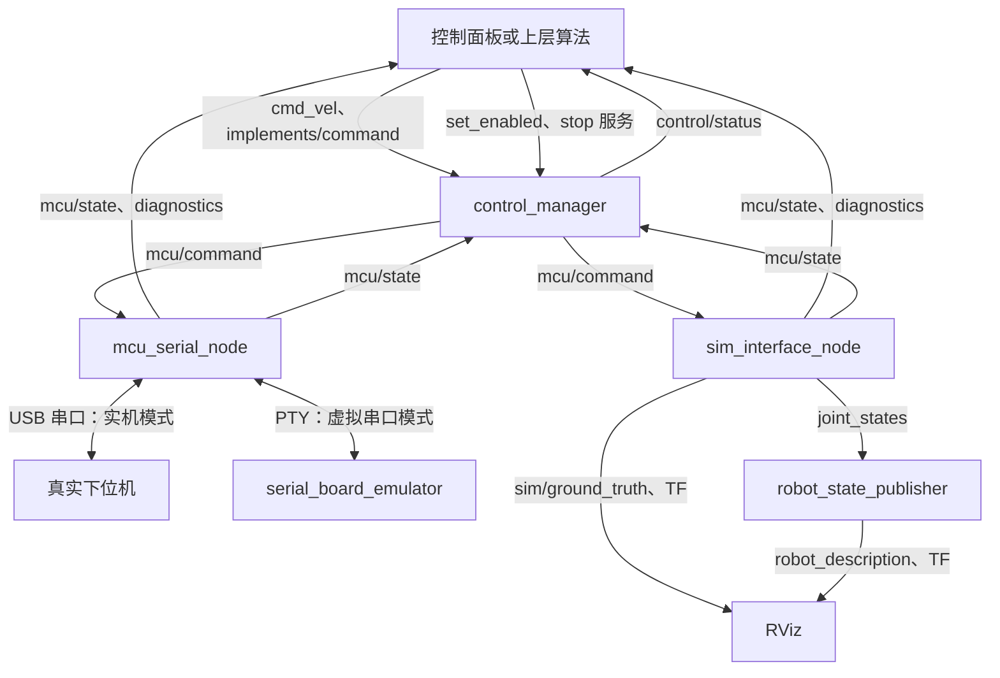

# 节点与数据流

本文描述默认未加命名空间的启动结果。实际在线节点用 `ros2 node list` 查看；测试工具可能临时创建额外节点。

## 1. 节点职责

| ROS 节点名 | 包 / 可执行文件 | 职责 |
|---|---|---|
| `/control_manager` | `terramind_control / control_manager_node` | 上层输入汇总、使能与有效期管理、完整快照输出 |
| `/mcu_serial_node` | `terramind_mcu / mcu_serial_node` | 串口发现、握手、协议收发、重连和后端独立保护 |
| `/sim_interface_node` | `terramind_sim / sim_interface_node` | 板卡行为模型、二维运动、仿真真值和故障注入 |
| `/terramind_panel` | `terramind_panel / control_panel` | 控制目标编辑、使能/停止、状态及诊断展示 |
| `/robot_state_publisher` | `robot_state_publisher / robot_state_publisher` | URDF 模型和车轮关节坐标变换 |
| `/rviz2` | `rviz2 / rviz2` | 模型、轨迹及坐标系显示 |
| `/terramind_control_cli` | `terramind_sim / control_cli.py` | 可选命令行控制源，手动启动时出现 |

`control_manager_node` 是可执行文件名，节点名是 `control_manager`。项目节点均运行于 PC，下位机本身不运行 ROS。

## 2. 三种后端组合

| 入口 | 必需 ROS 节点 | 附加程序/节点 |
|---|---|---|
| `real.launch.py` | `control_manager`、`mcu_serial_node` | `panel:=true` 打开面板；USB 连接真实板卡 |
| `sim.launch.py` | `control_manager`、`sim_interface_node` | 默认打开模型和 RViz；`panel:=true` 打开面板 |
| `serial_test.launch.py` | `control_manager`、`mcu_serial_node` | 必需的 PTY 模拟器进程；`panel:=true` 打开面板 |

`./start_sim.sh` 会给仿真 launch 加上面板参数；`--headless` 强制关闭面板和 RViz，`--no-panel` 只关闭面板。直接调用各 launch 时面板参数默认 false。

实机、二维仿真和虚拟串口三种后端不能在同一控制链路并行启动。面板与命令行工具也应作为替代的单一上层输入源使用；当前没有多源控制权仲裁节点。

## 3. 控制与反馈链路

图中 MCU 和 SIM 是互斥后端；USB 板卡和 PTY 模拟器也按模式二选一。控制面板还订阅 `mcu/command` 展示 PC 输出快照，但没有权限仲裁功能，也不直接操作串口。

## 4. 线程和普通进程

| 组件 | 执行方式 | 共享与退出约束 |
|---|---|---|
| 控制管理 | 单线程 ROS executor | 订阅、服务和 20 ms 定时器串行执行 |
| 串口后端 | ROS 回调线程 + 串口工作线程 | 共享保护器、连接 ID、能力和时间戳用 mutex；串口/解析器/会话由工作线程持有 |
| 直接仿真 | 单线程 ROS executor | 5 ms 调度；命令约 20 ms，状态与真值约 50 ms |
| 控制面板 | Qt 主线程内推进 ROS 回调和心跳 | GUI 卡住会停止续期；退出先尝试停止，再销毁节点 |
| PTY 模拟器 | 普通 POSIX 循环 | 不是 ROS 节点；用串口字节与驱动通信 |
| 调试总面板 | Qt GUI + 每任务一个监督进程 | 本身不是 ROS 节点；通过子进程启动 ROS/构建/测试 |

调试总面板的 `debug_runner.py` 给每个任务创建独立进程组，监听停止请求或 GUI 管道 EOF，按 SIGINT → SIGTERM → SIGKILL 分级清理子进程。它仅管理自己启动的任务，不会接管其他终端启动的节点。

`terramind_interfaces` 是消息包；`terramind_protocol`、`terramind_transport` 是库；`terramind_description`、`terramind_bringup` 提供资源和配置。包数量不等于运行节点数量。

## 5. 一次运行的时序

1. 启动时控制管理保持未使能，后端打开端口或初始化模型。
2. 后端发送全零未使能快照，观察状态是否确认本连接近期发送的命令。
3. 后端报告 `link_ready`；控制管理还检查状态年龄、故障和接纳结果。
4. 面板点击开始：发送零输入，先请求 Stop 并等应答，再请求 Enable。
5. 等控制管理反馈已使能后，面板开始周期发送用户选定目标。
6. 控制管理合并两路目标，后端保护器复核后转换为实际串口帧或模型输入。
7. 停止、超时、状态故障或连接更换会撤销输出；恢复通信后仍需明确重新使能。

上位机保护比固件恢复条件更严格：固件可在再次接纳合法使能帧后恢复，而 PC 后端会在故障后锁定，要求未使能快照和新一轮使能。不要删除这一差异来“简化”仿真或驱动。

## 6. 坐标与反馈边界

二维仿真发布 `sim_world → base_link`，模型节点发布 `base_link → left_wheel/right_wheel`。RViz 固定坐标为 `sim_world`。仿真位姿放在 `sim/ground_truth`，不冒充真实里程计。

当前没有实机 `/odom`、导航板定位节点、定位融合、路径规划、Gazebo 或 `/clock`。底盘反馈 RPM 轴侧和新鲜度尚待确认，后续增加真实里程计时需先补齐这些约定。

接口类型与详细语义见 [ROS 接口约定](ROS接口约定.md)，源码阅读与扩展步骤见 [开发指南](开发指南.md)。
